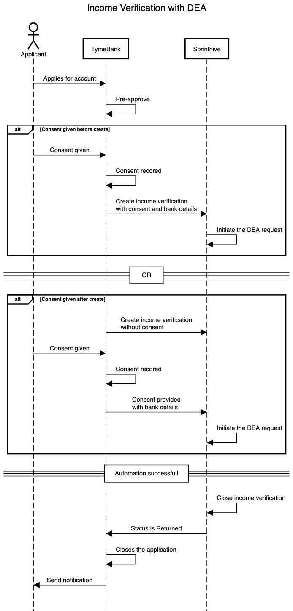

# DEA integration (Warning - This is a Work in Progress)

The purpose of this guide is to explain how to integrate with DEA

## Prerequisites

* Client ID and Client Secret - this will be provided by SprintHive, it is used to create an JWT token which will be required when calling the Income API
* An environment which has been configured with DEA enabled to test against
* Example test data 

## Configuration

> What is required to get this configured (Might not be part of this document however we need to put this somewhere)  
> Certificates etc... (Ask Dale for input here)  

### What is a business unit?

This is configured on DEA side and maps to a "product code"

### What is a provider business unit? 

This maps to a bank on the DEA side

### What is a customer reference? 

The incomeVerificationId is used as the customer reference, this is used as link the dea response to the 
income verification

## Process Flow
               


### Creating an income verification with DEA consent

Endpoint: ```/v1/incomeVerification```  
Request payload:
``` json
{
  ...
  "deaConsent": {
    "consentGiven": "",
    "businessUnit": "",
    "providerBusinessUnit": ""      
  },
  "physicalEntity": {
    "idNumber": "",
    "initials": "",
    "firstName": "",
    "surname": "",
    "emailAddress": "",
    "bankAccountNumber": "",
    "bankBranchCode": ""    
  },
  ...
}
```

### Updating an existing income verification with DEA consent

The following use case is useful when the DEA consent is received after the call which creates the income verification.

Send an HTTP POST to ```v1/incomeVerification/${incomeVerificationId}/deaConsent```  
Request body
```
{
  ...
  "deaConsent": {
    "consentGiven": "",
    "businessUnit": "",
    "providerBusinessUnit": ""      
  },
  "physicalEntity": {
    "idNumber": "",
    "initials": "",
    "firstName": "",
    "surname": "",
    "emailAddress": "",
    "bankAccountNumber": "",
    "bankBranchCode": ""    
  },
  ...
}
```
