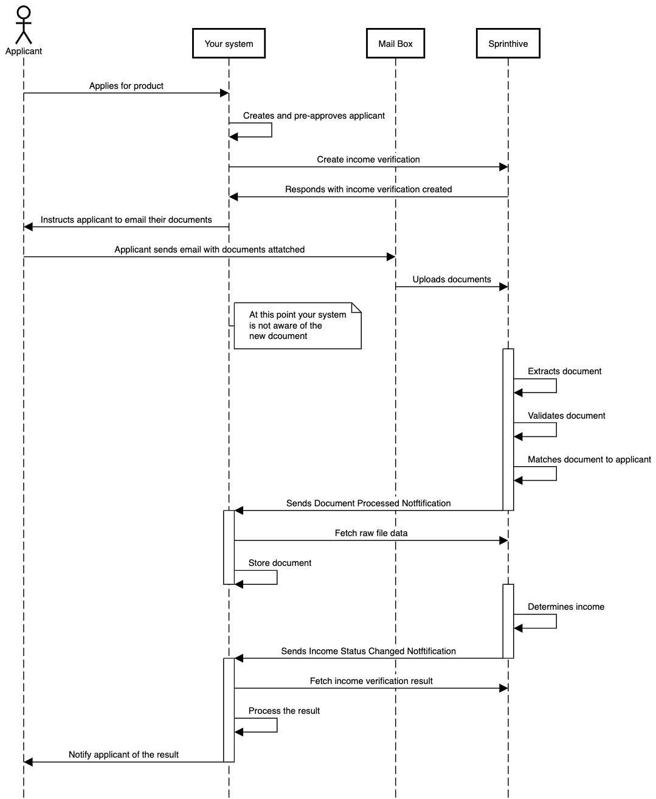
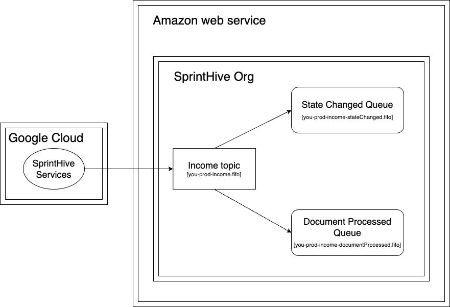
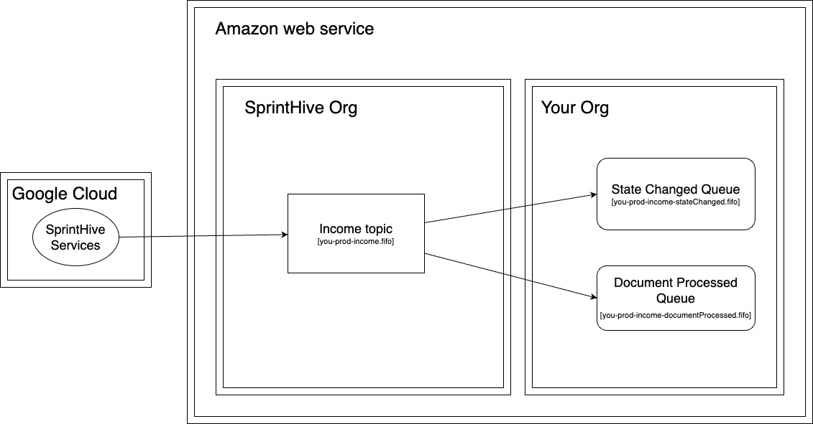

# Notifications

There are two different notifications available namely **Document Processed** and **Status Changed** notifications.
There are also options two options for integrating these notifications. Ether web hook https or SQS queues.

## Prerequisites
* You have read and understand the security section [click here for more details](../security/CreatingJsonWebToken.md)

## The process

Applicant: The person who is applying for the service or product.  
Your system: This is the system that integrates with SprintHives income verification product.  
Mailbox: This is SprintHive's email processing product.
SprintHive: This is SprintHive's income verification product.



## Document Processed Notifications

The document processed notifications can be useful to keep an external system in sync when documents are sent directly
to SprintHive via the email inbox or via the upload site. 

### When does the document processed event fire?

* When extracting a document fails
* When document validation fails
* When a document cannot be linked to a matched to the applicant (declared data is required)
* When a document has been successfully extracted

## Status Changed Notifications

The status changed notification is typically used to route the application to an automated or a manual review flow

### When does the status changed event fire?

The status changed event is fired when an income verification requests status changes as a result of documents received.  
The most common scenario is for the status to change from IN_PROGRESS to SUCCESS or FAILED


# SQS queues
## Option 1: SQS quese are hosted in SprintHives AWS account
The notifications flow into SQS queues within SprintHives AWS account.
In order for you to get these messages, SprintHive will authorize a principal from your AWS account to read and 
delete messages from these queues.
The benefit of this option is that you don't have to provision queues within your AWS account. This is also the con -- 
you don't have control over queue settings and can't easily change permissions, DLQ settings, etc.


## Option 2: SQS queues are hosted in Your AWS account
You create SQS queues within your AWS account and SprintHive authorizes them to subscribe to the AWS topic in our AWS account.
The notifications flow from SprintHives topic into your queue and there is no need for us to have SQS queues within our AWS account.
The benefits of this option is that you have complete control over the queue configuration and access to those queues.


# Creating the Web hook 

This is an alternative to using sqs queues. To enable the ability to receive a webhook notification your system needs to expose and endpoint which can receive
a POST message with a JSON payload.

An example of the notification payload
```json
{
  "incomeVerificationId": "",
  "correlationId": "",
  "documentId": ""
}
```

Your system can use the incomeVerificationId to fetch the latest state ([for more info](../../api/v2/GetIncomeVerificationState.md))  
The response has a list of documents that are linked to the income verification request and can be used to download the 
document ([for more info](../../api/v2/GetDocumentContent.md)) and then upload it to your system's file storage.
