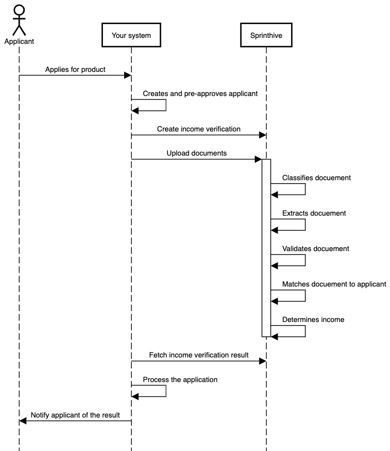

# Quick start guide

The purpose of the quick start guide is to provide the simplest scenario to integrate with the Income API.

## Prerequisites

 * Client ID and Client Secret - this will be provided by SprintHive, it is used to create an JWT token which will be required when calling the Income API
 * An environment to test against - this will be provisioned by SprintHive
 * An example bank statement

> A postman collection can be found in the postman directory
                                                            
## Process Flow

These are the 3 main API calls which will be made between your system and SprintHive
* Create an income verification - a POST request with a JSON body 
* Upload a bank statement - a Multipart form with a file parameter
* Get the result - a GET request which returns JSON 


                                                                                          
### Fetching and processing the result?

Endpoint: ```v1/incomeVerification/${incomeVerificationId}/result```  
Method: GET  
Response:
```json
{
  "incomeVerificationId":"xxx-xxx-xxx-xxx",
  "correlationId":"xxx-xxx-xxx-xxx",
  "status":"COMPLETE",
  "bankAccountNumber":"xxx-xxx-xxx",
  "bankName":"xxxx",
  "nettIncome":20193.59,
  "variance":0.009587,
  "confidence":1.0
}
```
                        
If the confidence is less than 0.5 we recommend sending the income verification to manual review.
Variance is the difference between what was found and what was declared depending on your margin of error you can decide
when to send the income verification to manual review.
