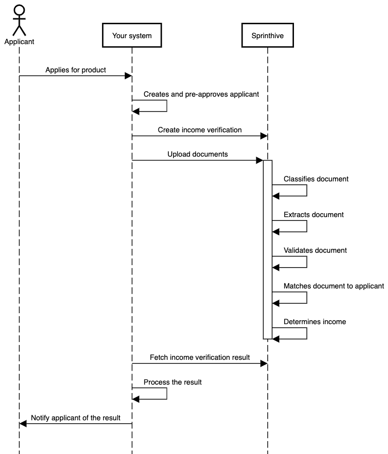

# Quick start guide

The purpose of the quick start guide is to provide the simplest scenario to integrate with the Income API.

## Prerequisites

 * Client ID and Client Secret - this will be provided by SprintHive, it is used to create an JWT token which will be required when calling the Income API
 * An environment to test against - this will provisioned by SprintHive
 * An example bank statement

> A postman collection can be found in the postman directory
                                                            
## Process Flow

These are the 3 main API calls which will be made between your system and SprintHive
* Create an income verification - a POST request with a JSON body 
* Upload a bank statement - a Multipart form with a file parameter
* Get the income verification state - a GET request which returns JSON describing the latest state of the income verification request



### 1. Create an income verification request

Endpoint: ```v2/incomeVerification```  
Method: POST  
Body:
```json
{
  "correlationId": "quick-start-1",
  "primaryIncome": {
    "nettIncome": "20000",
    "grossIncome": "25000"
  }
}
```

Response:
```json
{
  "incomeVerificationId": "49f9290c-d393-4af4-8072-0400303f64c8",
  "correlationId": "quick-start-1"
}
```

### 2. Upload a proof of income

Endpoint: ```v2/incomeVerification/{incomeVerificationId}/document```  
Method: POST  
Body:
```
FormData with the key "file"
```

Response:
```json
{
  "documentId": "ba7b81e3-d542-4fc4-9118-11808cca1f85"
}
```

### Fetching the income verification state

Endpoint: ```v2/incomeVerification/${incomeVerificationId}/state```  
Method: GET  
Response:
```json
{
    "status": "SUCCESS",
    "evidenceState": {
        "bankStatements": [
            {
                "documentId": "904e24e2-882a-485b-a3cd-0dc916211442",
                "documentHash": "4306ae617022feac27cd97b31d933163292b315c"
            }
        ],
        "payslips": [],
        "unknown": []
    },
    "result": {
        "method": "AUTOMATED",
        "status": "WITHIN_TOLERANCE",
        "analysisResult": {
            "primaryIncome": {
                "declaredNettIncome": 20000,
                "detectedNettIncome": 19226.92,
                "confidence": 0.9892,
                "variance": -0.04021,
                "payDates": [
                    "2021-05-01",
                    "2021-04-28"
                ],
                "payDay": 28,
                "payCycle": 30
            }
        }
    }
}
```
